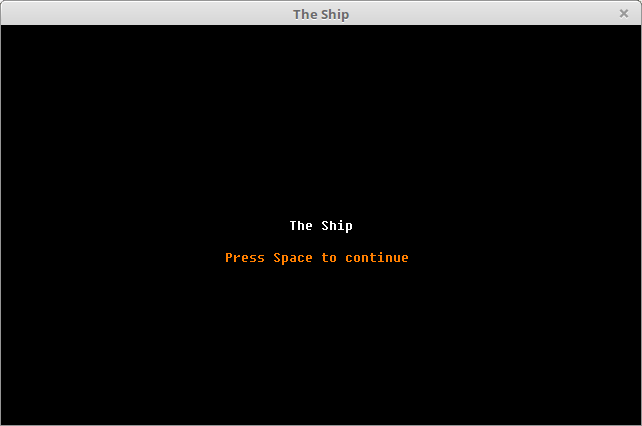
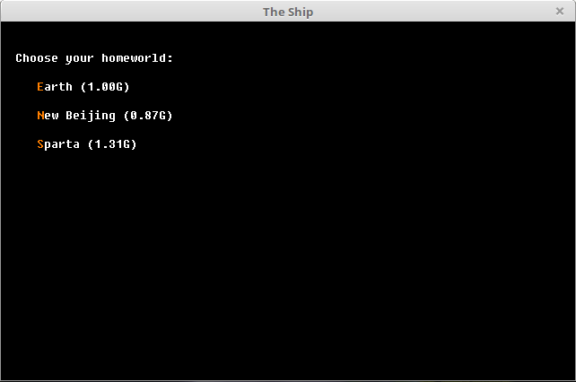
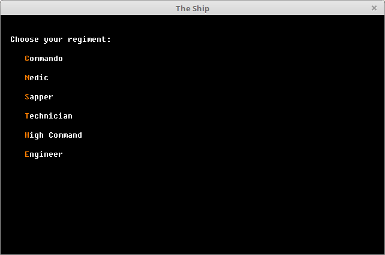
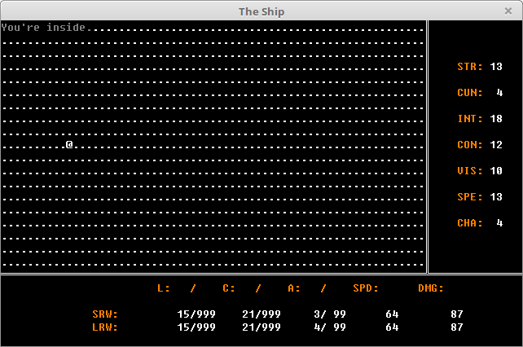

# About

A science fiction roguelike game using BearLibTerminal. (unfinished).

# Interface









# How to compile

To compile the project, you need a GCC 4.8 or later compiler and CMake.

```
cmake CMakeLists.txt
make
./TheShip
```

Thanks ...
